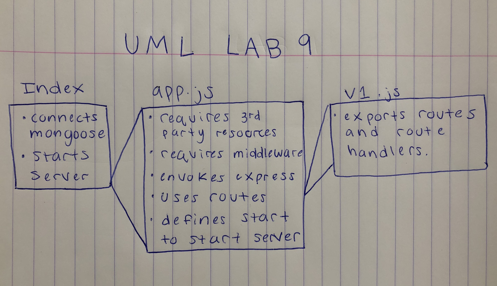

# LAB - 09

 ## API Server

 ### Author: Lillian Gales

 ### Links and Resources
* [submission PR](https://github.com/lilliangales-401-advanced-javascript/lab9-api-server/pull/1)
* [travis](https://travis-ci.com/lilliangales-401-advanced-javascript/lab9-api-server)
* [front-end](https://lab9-lillian.herokuapp.com/) 
* [docs](http://localhost:3003/docs/)

 ##### Exported Values and Methods

 ###### 
`get(category) -> promise`
`post(category) -> promise`
`put(category) -> promise`
`delete(category) -> promise`

 `get(product) -> promise`
`post(product) -> promise`
`put(product) -> promise`
`delete(product) -> promise`

 ### Setup
#### `.env` requirements
* `PORT` - 3003

 #### UML
